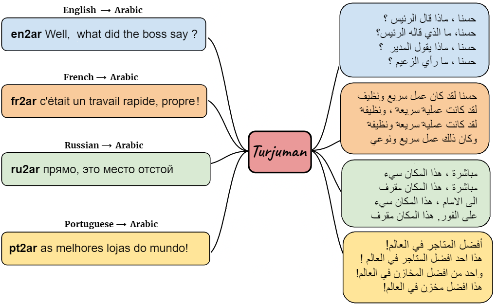

<p align="center">
    <br>
    
    <br>
<p>

<p align="center">
<a href="https://github.com/UBC-NLP/turjuman/releases">
        
    </a>

<a href="https://turjuman.dlnlp.ai">
        
    </a>
<a href="https://github.com/UBC-NLP/turjuman/blob/main/LICENSE"></a>
<a href="https://github.com/UBC-NLP/turjuman/stargazers"></a>
<a href="https://github.com/UBC-NLP/turjuman/network"></a>


</p>
 


TURJUMAN, a neural toolkit for translating from 20 languages into Modern Standard Arabic (MSA). TURJUMAN exploits the recently-introduced text-to-text Transformer [AraT5 model](https://github.com/UBC-NLP/araT5) (Nagoudi et al., 2022), endowing it with a powerful ability to decode into Arabic. The toolkit offers the possibility of employing a number of diverse decoding methods, making it suited for acquiring paraphrases for the MSA translations as an added value. To train TURJUMAN, we sample from publicly available parallel data employing a simple semantic similarity method to ensure data quality.

## Requirements and Installation
- To install turjuman and develop directly using pip:
 ```shell
    pip install turjuman
    or 
    pip install git+https://github.com/UBC-NLP/turjuman.git
 ```
- To install turjuman and develop locally:
 ```shell
    git clone https://github.com/UBC-NLP/turjuman.git
    cd turjuman
    pip install .
```
## Getting Started
The [full documentation](https://turjuman.readthedocs.io/en/latest/) contains instructions for getting started, translation using diffrent methods, intergrate Turjuman with your code, and provides more examples.

## Colab Examples
### (1) Command Line Interface
<table style='border:1px red;' width='100%'>
<tr><td><b>Command</b></td><td> <b>Content</b></td><td><b>Colab link</b></td></tr>
<tr>
<td>turjuman_translate</td>
<td>
    <ul>
        <li> Usage and Arguments </li>
        <li> Translate using greedy search</li>
        <li> Translate using beam search (default)</li>
        <li> Translate using sampling search</li>
        <li> Read and translate text from file</li>
    </ul>
</td>
<td>
<a href="https://colab.research.google.com/github/UBC-NLP/turjuman/blob/main/examples/turjuman_translate_cli.ipynb"></a>

 </td>
</tr>
<tr>
<td>turjuman_score</td>
<td>
    <ul>
        <li> Usage and Arguments </li>
        <li> Input files format</li>
        <li> Example</li>
    </ul>
</td>
<td> <a href="https://colab.research.google.com/github/UBC-NLP/turjuman/blob/main/examples/turjuman_score_cli.ipynb"></a></td>
</tr>
<tr>
<td>turjuman_interactive</td>
<td>
    <ul>
        <li> Usage and Arguments </li>
        <li> Input files format</li>
        <li> Example</li>
    </ul>
</td>
<td> <a href="https://colab.research.google.com/github/UBC-NLP/turjuman/blob/main/examples/turjuman_interactive_cli.ipynb"></td>
</tr>
</table>


## License
turjuman(-py) is Apache-2.0 licensed. The license applies to the pre-trained models as well.
## Citation
If you use TURJUMAN toolkit or the pre-trained models for your scientific publication, or if you find the resources in this repository useful, please cite our paper as follows (to be updated):
```


```


## 7. Acknowledgments
We gratefully acknowledge support from the Natural Sciences and Engineering Research Council  of Canada, the  Social  Sciences and  Humanities  Research  Council  of  Canada, Canadian  Foundation  for  Innovation,  [ComputeCanada](www.computecanada.ca) and [UBC ARC-Sockeye](https://doi.org/10.14288/SOCKEYE). We  also  thank  the  [Google TensorFlow Research Cloud (TFRC)](https://www.tensorflow.org/tfrc) program for providing us with free TPU access.
